# SM_Coursework_02

----

Tested on: **Lab Machine**

Build script: **Gradle**

Words count: **510**

----

## **Screen Shots**

   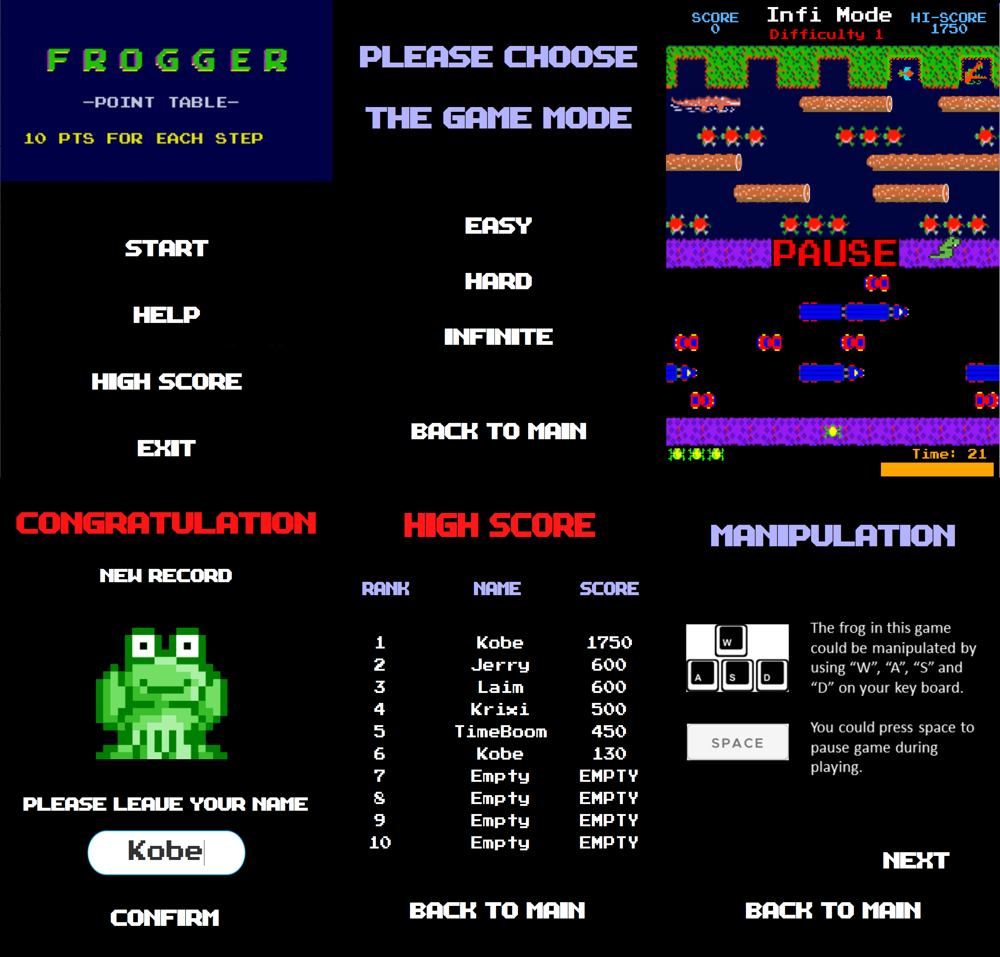

----
## **For maintenance**

* **Package rearrangement**
    1. ```src```

        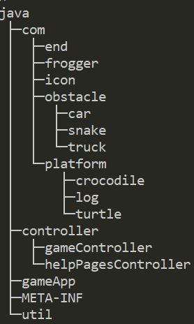
        * ```com```: Contains game elements;
        * ```controller```: Contains FXML controllers;
        * ```gameApp```: Contains Main class;
        * ```util```: Contains tools.

    2. ```resources```

        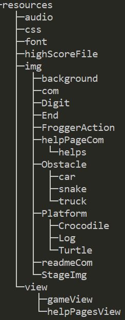

    3. ```test```

        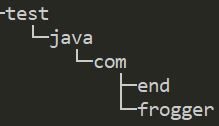
        * ```com```

* **Bugs refactor**
    1. Frogger move:
        * Generates from coniguous ```keyboardPress```;
        * Fixed by checking position after ```keyboardRelease```.

    2. Points display:
    
         
        * Generates from points deduction;
        * Fixed by applying ```Text``` ```playerScoreBoard```;

* **MVC design pattern**
    1. Refactored ```World```:
        * Refactored into ```GameController```;
        * Better extendability.

    2. Refactored ```Actor``` and all of its child classes:
        * Refactored into ```View```, ```Controller``` and ```Model```;
        * Elements with large classes e.g.```Animal```, are broken down into 3 classes;
        * Other game elements have their own ```View``` class;
        * Better testability (```Model``` and ```Controller``` could be tested without launching);
        * Better extendability (```Controller``` and ```Model``` provide extra interfaces).

    3. New pages all applied MVC design pattern:
        * Easy for future maintenance and extension.

* **SINGLETON  design pattern**
    1. ```FroggerView```: 
        * Better maintainability (Prevent redundant).

    2. ```MusicPlayer```:
        * Better extendability (Lower coupling).

* **Factory design pattern**
    1. ```ElementFactory```: 
        * Better extendability (Lower coupling);
        * Better maintainability (Separate users from actual implementation).
        
* **Builder design pattern**
    1. ```MapReader```:
        * Better extendability (Lower coupling, convenient for creating new maps);
        * Better maintainability (Prevent redundant code).
----
## **For extension**

* **Additional pages**
    1. ```MenuView```;
    2. ```DifficultyLevelSelectionView```;
    3.  ```gameView```;
    4. ```InputNameView```;
    5. ```HighScoreView```;
    6. ```helpPagesView```.
    
* **Game termination**
    1. Lost all life:
    
        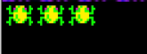
        * Used up all life;
        * Gets a deduction of 50 points each time.
        
    2. Used all time:
        * Used up 60 seconds, frogger dies;
        * Time is refreshed after death or survival.

* **Extra game elements**
    1. ```CrocEnd``` and ```BugEnd``` classes:
    
        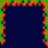
        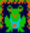
        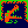
        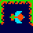
        * Implemented in ```Hard``` mode and ```Infinite``` mode;
        * ```EndView```'s status could change every 6 seconds;
        * ```CrocEnd```: Lethal ```End``` which could kill frogger;
        * ```BugEnd```: ```End``` with a snack provides extra bonus.
        
    2. ```Snake```:
    
        
        * Implemented in ```Hard``` and ```Infinite``` mode;
        * A lethal ```Snake``` appears in the middle lane of the game stage.
        
    3. ```Crocodile```:
    
        
        * Implemented in ```Hard``` and ```Infinite``` mode;
        * The head of ```Crocodile``` is lethal when it is open.

* **Extra game feature**
    1. Pause:
    
        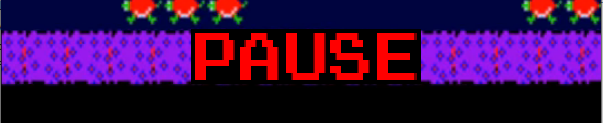
        * Press SPACE on the keyboard to pause;
        * Press SPACE to restart the game.
        
    2. Animation:
        * Remade the original one in ```MenuView```;
        * Another in ````InputNameView````.
        
    3. Time counter and time bar:
    
        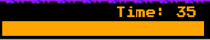
        
    4. ```InfiniteGameController```:
    
        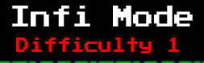
        * Implemented in ```Infinite``` mode;
        * Player could play infinite terms with increasing difficulty;
        * The difficulty is calculated according to **Curve grow algorithm**.
        
    5. Background music:
        * Different music for different pages.
        
    6. Create new map:
    
        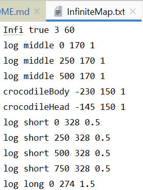
        * Better extendability;
        * **New** game map could be created in file (```.txt```) under ```/src/resources/map/```
        * First line contains basic game data
        
        
## **Work Log**

*   Summary:

    According to [LOG.md](./LOG.md), from November 17th to December 8th, I'm focusing on refactoring and making extensions.<br>
    From December 1st to the end, documentation and build framework development became my most important target.
    
    By recording a log file throughout the project, I gained a better perspective towards the process of my developing.

*   [Full log](./LOG.md)