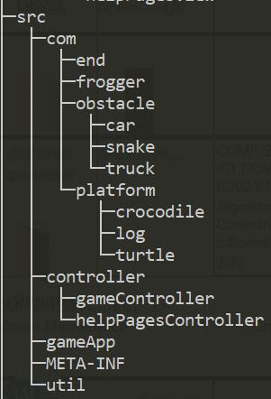
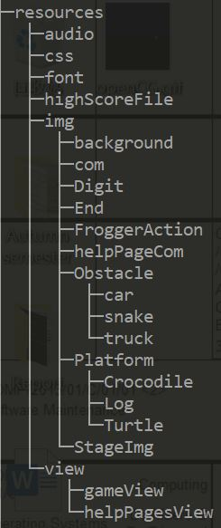
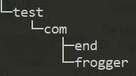
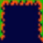
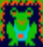
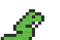

# SM_Coursework_02

----

Tested on: **Lab Machine**

Build script: **Ant**

----

## **For maintenance**

* **Package rearrangement**
    1. ```src``` directory:

        
        * ```com``` <19/Nov/2019>: Contains game elements;
        * ```controller``` <28/Nov/2019>: Contains FXML controllers;
        * ```gameApp``` <19/Nov/2019>: Contains Main class;
        * ```util``` <20/Nov/2019>: Contains tools.

    2. ```resources``` directory <20/Nov/2019>

        

    3. ```test``` directory:

        
        * ```com``` <21/Nov/2019>

* **Bugs refactor**
    1. Frogger move <21/Nov/2019>:
        * Generates from coniguous ```keyboardPress```;
        * Fixed by checking position after ```keyboardRelease```.

    2. Points display <21/Nov/2019>:
        * Generates from points deduction;
        * Fixed by applying ```Text``` ```playerScoreBoard```;

* **MVC design pattern**
    1. Refactored ```World``` <03/Dec/2019>:
        * ```World``` is refactored into ```GameController```;
        * Background image is allocated in FXML files of game modes;
        * Better extendability, different game modes could be extended from it.

    2. Refactored ```Actor``` and all of its child classes <26/Nov/2019>:
        * ```Actor``` is refactored into ```View```, ```Controller``` and ```Model```;
        * Elements will large classes e.g.```Animal```, are broken down into three classes;
        * Other game elements have their own ```View``` class;
        * Better testability, extendability (```Controller``` and ```Model``` provide extra interfaces).

    3. New pages all applied MVC design pattern <01/Dec/2019>:
        * Easy for future maintenance and extension.

* **SINGLETON  design pattern**
    1. ```FroggerView``` <20/Nov/2019>: 
        * Only be accessed by ```getInstance()```.

    2. ```MusicPlayer``` <29/Nov/2019>: 
        * ```MyStage```'s feature is refactored into ```MusicPlayer``` (Better utility);
        * Only contains ```static``` methods.

* **Factory design pattern**
    1. ```ElementFactory```<10/Dec/2019>: 
        * A factory for ```View``` and all of its child classes.
----
## **For extension**

* **Additional pages**
    1. ```MenuView``` <29/Nov/2019>;
    2. ```DifficultyLevelSelectionView``` <29/Nov/2019>;
    3. Three ```gameView``` <02/Nov/2019>;
    4. ````InputNameView```` <01/Nov/2019>;
    5. ```HighScoreView``` <01/Dec/2019>;
    6. Four ```helpPageeView``` <02/Dec/2019>.
    
* **Game termination**
    1. Lost all lifes <27/Nov/2019>:
        * Player used up his all chances of life;
        * Player gets a deduction of 50 points each time.
    2. Used all time <08/Dec/2019>:
        * Each time player used up his 90 seconds, frogger dies automatically;
        * Time will be refreshed after frogger dies or reaches end.

* **Extra game elements**
    1. ```CrocEnd``` and ```BugEnd``` classes <01/Dec/2019>:
    
        
        
        
        
        * Implemented in ```Hard``` mode and ```Infinite``` mode;
        * ```End``` status could change in every 6 seconds;
        * ```CrocEnd```: A lethal ```End``` which could kill the frogger;
        * ```BugEnd```: An ```End``` with a snack which provides player extra bonus.
    2. ```Snake``` <05/Dec/2019>:
    
        
        * Implemented in ```Hard``` mode and ```Infinite``` mode;
        * A lethal ```Snake``` appears in the middle lane of the game stage.
    3. ```Crocodile``` <07/Dec/2019>:
    
        
        
        * Implemented in ```Hard``` mode and ```Infinite``` mode;
        * The head of ```Crocodile``` is lethal when it is open.

* **Extra game feature**
    1. Pause <05/Dec/2019>:
        * Press SPACE on the keyboard to pause;
        * Press SPACE to restart the game.
    2. Animation <05/Dec/2019>:
        * Remade the original one in ```MenuView```;
        * Another in ````InputNameView````.
    3. Time counter <08/Dec/2019>:
        * Player only have 90 seconds in each term of the game;
        * Time counter will be refreshed after each time player die or reach the end;
        * When time is counted down to 0, ```Frogger``` will die immediately. 
    4. ```InfiniteGameController``` <02/Dec/2019>:
        * Implemented in ```Infinite``` mode;
        * Player could play infinite terms of game with increasing difficulty.
    5. Background music:
        * Different music for different groups of pages.